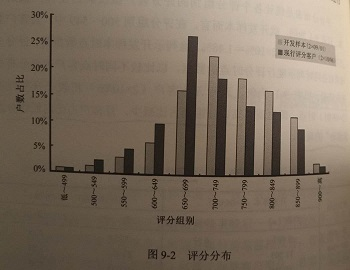

## 什么是评分卡

评分卡是综合个人客户的多个维度信息（如基本情况、偿债能力、信用状况等，重点关注借贷意愿、偿债能力、还款意愿），基于这些信息综合运用数学分析模型，给个人综合评分，判断违约的可能性的工具。

生活中存在许多“显性”或“隐性”的“评分卡”。例如：选购汽车综合价格、油耗、安全系数、性能、外观等来因素。买还是不买？包括之前小编实参与的车联网交通数据清理，如何评价车主是否为“中国好司机”会涉及到车辆是否绿色出行（早晚高峰、周末是否出行），车主的驾驶行为（是否疲劳驾驶、是否夜间驾驶、急加速急转弯百公里次数等）以及月出行次数的合理程度等。

信用评分卡常被分为Application Score, Behavior Score, Collection Score.

## 常用特征

* 基本人口属性：年龄、性别、婚姻状况、学历、户籍性质

* 还款能力：资产情况（房、车）、负债情况（征信报告、信用卡流水、多头借贷等）、征信查询次数、收入情况（工资）：家庭月收入、消费情况（流水）：家庭月支出
* 居住地于消费等的稳定性与借款用途

* 还款意愿：在其它平台信用状况（芝麻信用、FICO）、历史信用状况等

## 常用算法

决策树、logistic regression、random forest

经典算法中自变量离散化后会使用WOE（weight of evidence, 证据权重）编码后再进行建模，WOE反映的是自变量每个分组下违约用户对正常用户占比和总体中违约用户对正常用户占比之间的差异，蕴含了自变量对于目标变量的影响。

## 算法步骤

### 定义好坏客户

坏客户：比如可以定义为出现过逾期60天或90天以上的客户（可以根据滚动率情况判断，如M2-M3滚动率为80%，说明大多数客户在逾期60天后大概率会逾期90天）。

信用评分模型以“户数”为单位计算，而一般评估风险所惯用的逾期比率则是以金额为计算单位。

### 确定样本空间

样本空间的确定要考虑样本是否具有代表性。因为信用评分模型是以历史数据为基础，其准确性建立在未来的信用表现于过去相同的假设前提之上。一旦遭遇重大经济变动，假设不再成立，模型的预测能力就会收到影响。

#### 时间窗口选择

表现期：在某个MOB达到稳定的坏账率的时候（账龄分析）。其长短与风险释放长短相关。

观察期：回溯需要纳入观察的时间

### 数据清洗

### 特征选择

#### 分箱（连续特征离散化，方便后续评分）

原则：

* 组间差异大、组内差异小
* 每组占比不低于5%
* 必须有好、坏两种分类

##### 无监督分箱

* 等频分箱：把观测值按照大小顺序排列，根据观测的个数等分为k部分
* 等距分箱：将变量的取值范围分为k个等宽区间，每个区间当做一个分箱

##### 有监督分箱

* 卡方分箱：判断相邻的两个区间是否有分布差异，基于卡方统计量的结果进行自下而上的合并，直到满足分箱的限制条件为止。

#### WOE与IV

$$
WOE = ln(p(good)/p(bad))   \\
IV = \sum(good占比 - bad占比)*WOE_i
$$

根据IV值来调整分箱结构并重新计算WOE和IV，直到IV达到最大值，此时的分箱效果最好。

### 建模与调参

### 模型评估与验证

可使用AUC、KS及好坏客户的分布情况进行评估。

### 概率转化为标准评分卡

#### 标准评分卡定义

坏客户的概率 P(y=1|x) = p  , 好客户的概率为1-p。好坏客户的比率 odds=(1-p)/p。评分卡设定的分支刻度可以通过将分值表示为比率对数的线性表达式：score = A + B* ln(odds). Logistic 回归中：
$$
p(y=1|x) = 1/(1+e^{-wx})  \\
p(y=0|x) = 1- 1/(1+e^{-wx})
$$

$$
odds = e^{-wx}
$$

score = A - B*WX

每个变量得分 = A - B*w

其它模型如得出概率后，可假设odds = 1:1, 此时score为300分, odds为2:1时分值增加20分，则可组成两个方程计算得出A、B的值。根据A、B值则可计算其它概率时对应的分值。

### 拒绝推论

多用于申请评分卡，由于初步建立的模型所采用的样本皆来自核准案件，这样建立的模型并不能代表真实的样本集，因此可以通过使用拒绝推论推测拒绝案件的好坏，以修正模型。较常使用的为扩充法，先以核准客户为样本建立初步模型，接着将拒绝案件套入该模型，以推测其好坏，再与原核准客户样本合并建立新的模型。

### 模型监控

#### 前端表现监控

##### 评分分布表

##### PSI(population stability index)

psi = sum(（现行时点评分客户占比-开发样本时点评分客户占比）/ln(现行时点评分客户占比/开发样本时点评分客户占比))

一般认为psi小于0.1时模型稳定性很高。PSI仅显示母体分布是否产生变动，无法了解母体往高分组或低分组移转，需搭配评分分布表才能判断变化方向。

#### 后端模型指标监控

KS是否变化等。

## 后记

当真时任何事情深入去做都有学问的，仅仅一个评分卡要是细作，真的需要不少心思。在成熟企业不断精细化管理的情况下，只有精耕细作才能保持竞争优势的。

