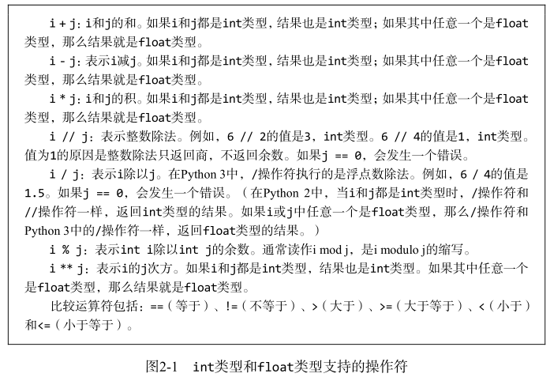

# python编程导论

notes1-4是根据书籍《python编程导论》记录的笔记，该书是作者根据MIT公开课整理而成，视频课程地址：<https://ocw.mit.edu/courses/electrical-engineering-and-computer-science/6-0001-introduction-to-computer-science-and-programming-in-python-fall-2016/>

## 1. 启程

计算机：计算&保存。

什么是计算思维？

陈述性知识：由对事实的描述组成，例：如果满足y*y=x，那么x的平方根就是数值y；程序性知识：说明‘如何做’，描述的是信息演绎的过程，例：亚历山大的海伦（Heron of Alexandria）第一次提出如何计算一个数的平方根。他的方法可以总结如下：
(1) 随机选择一个数g；
(2) 如果g × g足够接近x，那么停止计算，将g作为答案；
(3) 否则，将g和x/g的平均数作为新数，也就是(g + x/g)/2；
(4) 使用新选择的数——还是称其为g——重复这个过程，直到g × g足够接近x。

## 2. python简介

如果想创建高可靠性的程序，python并不是最好的选择（因为它的静态语义检查比较弱的）

对象是python程序化处理的核心元素

python有4个标量对象：int/float/bool/None

对象和操作符可以组成表达式

’=‘赋值  ’==‘比较运算



bool 类型上的基本操作符为 and 、 or 和 not

在Python中，变量仅是名称，没有其他意义。

一个对象可以有一个或多个名称与之关联，也可以不关联任何名称。

Python变量名是大小写敏感的，Python中还有少量的保留字（有时称为关键字），它们有专门的意义，不能用作变量名。

Python支持多重赋值。以下语句：
x, y = 2, 3

### 2.2 程序分支

if语句

### 2.3 字符串和输入

str   '124'

输入  input()

### 2.4 迭代

与条件语句类似，它从一个测试条件开始。如果测试条件取值为 True ，程序就执行一次循环体，然后重新检查测试条件。一直重复这个过程，直到测试条件为 False ，此后程序控制权就传递给迭代语句后面的代码。

有时候，不用检查循环条件就跳出循环是非常方便的。我们可以使用break语句结束它所在的循环，将控制流转到紧随循环语句后面的代码中。

```python
#find a positive integer that is divisible by both 11 and 12
x = 1
while True:
    if x%11 == 0 and x%12 == 0:
        break
    x = x + 1
print(x,'is divisible by 11 and 12')
```

## jupyter notebook notes

<https://nbviewer.jupyter.org/github/jerpson/python_basic_program/blob/master/program_using_python.ipynb>

